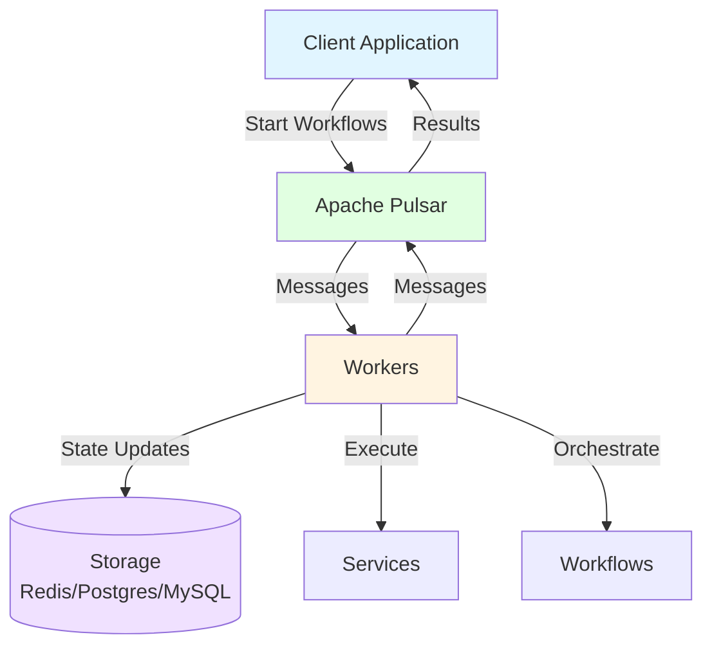
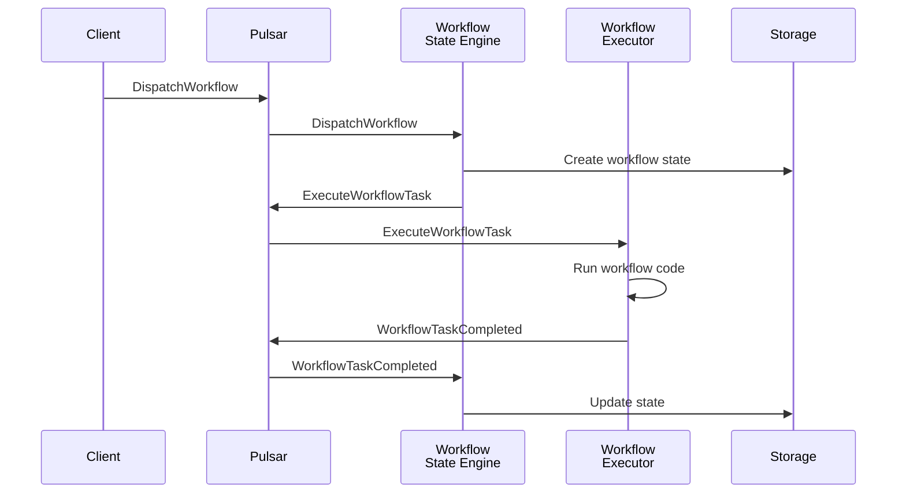
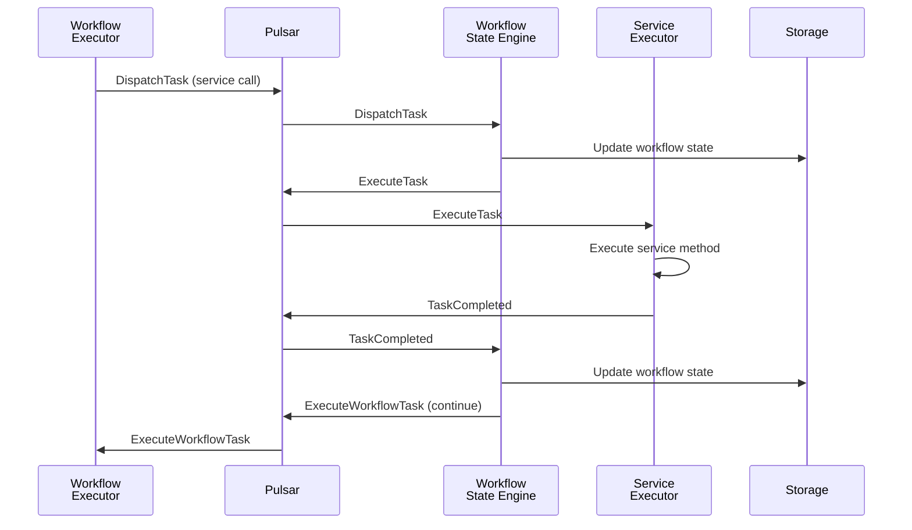

Infinitic is an event-driven orchestration framework that coordinates distributed workflows and services. This page explains how all components work together to provide durable, scalable, and reliable workflow execution.

## System Overview

Infinitic consists of four main components:



<CardGroup cols={2}>
  <Card title="Clients" icon="laptop-code">
    Application code that starts and interacts with workflows
  </Card>
  <Card title="Workers" icon="gears">
    Runtime components that execute workflows and services
  </Card>
  <Card title="Apache Pulsar" icon="message">
    Event streaming platform for reliable message delivery
  </Card>
  <Card title="Storage" icon="database">
    State persistence for workflows (Redis, Postgres, MySQL)
  </Card>
</CardGroup>

## Core Components

### 1. Clients

Clients are application code that interacts with Infinitic:

- **Start workflows** with parameters and tags
- **Send signals** to running workflows via channels
- **Query status** of workflows and tasks
- **Manage workflows** (cancel, retry, complete timers)

```kotlin
// Client creates workflow stub and calls methods
val client = InfiniticClient.fromYamlResource("/config.yml")
val workflow = client.newWorkflow(OrderWorkflow::class.java)
val result = workflow.processOrder(orderId)
```

**Source**: `infinitic-client/src/main/kotlin/io/infinitic/clients/InfiniticClient.kt`

### 2. Workers

Workers are long-running processes that execute workflows and services. Each worker can run multiple components:

#### Service Executor
Executes service methods when called by workflows:
```kotlin
class PaymentServiceImpl : PaymentService {
    override fun charge(orderId: String, amount: Double): PaymentResult {
        // Execute actual payment logic
        return paymentGateway.process(orderId, amount)
    }
}
```

#### Workflow Executor  
Executes workflow tasks (the workflow code itself):
```kotlin
class OrderWorkflowImpl : Workflow(), OrderWorkflow {
    private val paymentService = newService(PaymentService::class.java)
    
    override fun processOrder(orderId: String): OrderResult {
        // Workflow orchestration logic
        val payment = paymentService.charge(orderId, 99.99)
        return OrderResult(payment.transactionId)
    }
}
```

#### Workflow State Engine
Manages workflow state, handles events, and dispatches tasks:
- Stores workflow state in configured storage (Redis/Postgres/MySQL)
- Processes events (task completed, task failed, timer completed)
- Dispatches new workflow tasks
- Manages workflow lifecycle

#### Tag Engines
Manage tags for workflows and services:
- Map tags to workflow/service IDs
- Enable lookup by custom identifiers
- Support multiple IDs per tag

**Source**: `infinitic-worker/src/main/kotlin/io/infinitic/workers/InfiniticWorker.kt`

### 3. Apache Pulsar

Pulsar provides reliable, ordered message delivery:

- **Topics per entity**: Separate topics for each service/workflow
- **Guaranteed delivery**: Messages are persisted and replayed if needed
- **Ordered processing**: Messages with the same key are processed in order
- **Scalability**: Distribute load across consumers

**Topic Structure**:
```
infinitic/dev/service-executor/PaymentService
infinitic/dev/service-tag-engine/PaymentService
infinitic/dev/workflow-executor/OrderWorkflow
infinitic/dev/workflow-state-engine/OrderWorkflow
infinitic/dev/workflow-state-cmd/OrderWorkflow
infinitic/dev/workflow-tag-engine/OrderWorkflow
```

### 4. Storage Layer

State persistence for workflows:

**Key-Value Storage**:
- Workflow state by workflow ID
- Tag mappings (tag → workflow IDs)
- Serialized using efficient binary format

**Supported Backends**:
- **Redis**: Fast, in-memory storage
- **PostgreSQL**: Relational database with ACID guarantees  
- **MySQL**: Popular relational database
- **In-Memory**: For testing only (not persistent)

**Source**: `infinitic-storage/src/main/kotlin/io/infinitic/storage/`

## Message Flow

### Starting a Workflow



### Service Call from Workflow



## Workflow State Management

Workflows maintain state across service calls:

### State Components

1. **Workflow Properties**: Current values of workflow fields
2. **Method State**: Running methods and their local variables
3. **Step History**: Completed steps and their results
4. **Running Commands**: In-flight service calls and child workflows
5. **Timers**: Active timers and their completion times

### State Persistence

From `infinitic-workflow-engine`:

```kotlin
// Workflow state is stored as binary
interface WorkflowStateStorage {
    suspend fun getState(workflowId: WorkflowId): WorkflowState?
    suspend fun updateState(workflowId: WorkflowId, state: WorkflowState)
    suspend fun deleteState(workflowId: WorkflowId)
}
```

State is:
- **Serialized efficiently** using binary format
- **Compressed** optionally to reduce storage size
- **Cached** optionally using Caffeine cache
- **Logged** for debugging via LoggedWorkflowStateStorage

**Source**: `infinitic-workflow-engine/src/main/kotlin/io/infinitic/workflows/engine/storage/`

## Execution Guarantees

### Durability

Workflows survive failures through:

1. **State Persistence**: Workflow state saved after each step
2. **Message Durability**: Pulsar persists messages until acknowledged
3. **Replay from State**: Workers replay workflow from saved state
4. **Idempotent Operations**: Duplicate messages handled safely

### Ordering

From `InfiniticWorker.kt`, messages are processed:

- **With key**: Messages with same key processed sequentially
- **Without key**: Messages processed concurrently up to concurrency limit

This ensures:
- Workflow state updates are sequential
- Service tasks can be parallel
- Tag updates are consistent

### At-Least-Once Delivery

All operations have at-least-once semantics:
- Messages may be delivered multiple times
- Services should be idempotent when possible
- Workflow replay is deterministic (same inputs → same outputs)

## Scalability

### Horizontal Scaling

**Workers**:
- Add more worker instances
- Each consumes from same topics
- Load distributed automatically by Pulsar

```bash
# Scale to 3 workers
kubectl scale deployment infinitic-worker --replicas=3
```

**Pulsar**:
- Add more brokers for message throughput
- Add more bookies for storage throughput

### Vertical Scaling

**Concurrency**:
```yaml
workflows:
  - name: OrderWorkflow
    concurrency: 50              # Parallel workflow tasks
    stateEngine:
      concurrency: 20            # State engine concurrency
```

**Batching**:
```yaml
services:
  - name: EmailService
    batch:
      maxMessages: 100           # Batch up to 100 messages
      maxSeconds: 1              # Or every 1 second
```

## Modules Overview

Infinitic codebase is organized into modules:

| Module | Purpose | Location |
|--------|---------|----------|
| `infinitic-common` | Shared data structures and interfaces | Core types, messages |
| `infinitic-client` | Client API and implementation | InfiniticClient |
| `infinitic-worker` | Worker runtime and configuration | InfiniticWorker |
| `infinitic-storage` | Storage abstraction and implementations | Redis, Postgres, MySQL |
| `infinitic-cache` | Caching layer for storage | Caffeine cache |
| `infinitic-transport` | Transport abstraction | Message routing |
| `infinitic-transport-pulsar` | Pulsar implementation | Pulsar topics, producers |
| `infinitic-workflow-engine` | Workflow state management | State engine, handlers |
| `infinitic-task-executor` | Service execution | Task execution logic |
| `infinitic-task-tag` | Service tag management | Tag engine |
| `infinitic-workflow-tag` | Workflow tag management | Tag engine |

## Deployment Patterns

### Monolithic Deployment

Single worker running all components:

```yaml
# All-in-one worker
services:
  - name: PaymentService
    class: com.example.PaymentServiceImpl
    concurrency: 10
    tagEngine:
      concurrency: 5

workflows:
  - name: OrderWorkflow
    class: com.example.OrderWorkflowImpl
    concurrency: 5
    stateEngine:
      concurrency: 10
    tagEngine:
      concurrency: 5
```

### Separated Deployment

Different workers for different responsibilities:

```yaml
# Worker 1: Service executors only
services:
  - name: PaymentService
    class: com.example.PaymentServiceImpl
    concurrency: 50
```

```yaml
# Worker 2: Workflow executors only
workflows:
  - name: OrderWorkflow
    class: com.example.OrderWorkflowImpl
    concurrency: 20
```

```yaml
# Worker 3: Engines only
services:
  - name: PaymentService
    tagEngine:
      concurrency: 10

workflows:
  - name: OrderWorkflow
    stateEngine:
      concurrency: 20
    tagEngine:
      concurrency: 10
```

### Kubernetes Deployment

```yaml
apiVersion: apps/v1
kind: Deployment
metadata:
  name: infinitic-worker
spec:
  replicas: 3
  selector:
    matchLabels:
      app: infinitic-worker
  template:
    metadata:
      labels:
        app: infinitic-worker
    spec:
      containers:
      - name: worker
        image: myorg/infinitic-worker:latest
        env:
        - name: INFINITIC_CONFIG
          value: /config/infinitic.yml
        volumeMounts:
        - name: config
          mountPath: /config
      volumes:
      - name: config
        configMap:
          name: infinitic-config
```

## Observability

### Cloud Events

Infinitic emits Cloud Events for all operations:

```kotlin
class MyEventListener : CloudEventListener {
    override fun onEvent(event: CloudEvent) {
        when (event.type) {
            "task.started" -> metricsClient.increment("task.started")
            "task.completed" -> {
                metricsClient.increment("task.completed")
                val duration = event.extensionNames.get("duration")
                metricsClient.recordDuration("task.duration", duration)
            }
            "workflow.completed" -> {
                alertingClient.sendSuccess(event.source, event.id)
            }
        }
    }
}
```

### Logging

From `InfiniticWorker.kt:144-176`, workers log in-flight message counts on shutdown:

```
In Flight Messages:
* TaskExecutor: 5 remaining (1000 received)
* WorkflowStateEngine: 2 remaining (500 received)
```

### Metrics

Integrate with monitoring systems:
- Message throughput
- Task execution time
- Workflow duration
- Error rates
- Queue depths

## Best Practices

<CardGroup cols={2}>
  <Card title="Separate Concerns" icon="layer-group">
    Run executors and engines in different workers for better scaling
  </Card>
  <Card title="Use Caching" icon="bolt">
    Enable state caching to reduce storage load
  </Card>
  <Card title="Monitor Queues" icon="chart-line">
    Track Pulsar queue depths to detect bottlenecks
  </Card>
  <Card title="Plan for Failure" icon="shield-check">
    Design workflows to be resilient to service failures
  </Card>
</CardGroup>

## Next Steps

<CardGroup cols={2}>
  <Card title="Workflows" href="/concepts/workflows" icon="diagram-project">
    Learn about workflow patterns and features
  </Card>
  <Card title="Services" href="/concepts/services" icon="server">
    Implement services for your business logic
  </Card>
  <Card title="Workers" href="/concepts/workers" icon="gears">
    Deploy and configure workers
  </Card>
  <Card title="Clients" href="/concepts/clients" icon="laptop-code">
    Interact with workflows from your applications
  </Card>
</CardGroup>