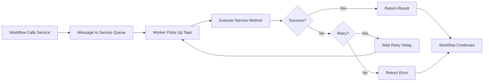

Services are the building blocks of your application in Infinitic. They contain the actual business logic, API calls, database operations, and integrations with external systems that workflows orchestrate.

## What is a Service?

A service in Infinitic is a simple class that implements a defined interface. Unlike workflows, services:

- **Execute actual work**: API calls, database operations, computations
- **Can be non-deterministic**: Use current time, random values, external APIs
- **Are stateless**: Each execution is independent
- **Can fail and retry**: Automatic retry mechanisms handle transient failures

<CardGroup cols={2}>
  <Card title="Simple Implementation" icon="code">
    Services are plain classes with business logic
  </Card>
  <Card title="External Integration" icon="plug">
    Call APIs, databases, and third-party services
  </Card>
  <Card title="Automatic Retry" icon="arrows-rotate">
    Built-in retry mechanisms for failures
  </Card>
  <Card title="Distributed Execution" icon="network-wired">
    Services scale across multiple workers
  </Card>
</CardGroup>

## Creating a Service

Services are defined with an interface and implementation:

```kotlin
// Service interface
interface PaymentService {
    fun charge(orderId: String, amount: Double): PaymentResult
    fun refund(orderId: String): RefundResult
    fun getStatus(transactionId: String): PaymentStatus
}

// Service implementation
class PaymentServiceImpl : PaymentService {
    override fun charge(orderId: String, amount: Double): PaymentResult {
        // Call external payment gateway
        val response = paymentGateway.processPayment(orderId, amount)
        
        return PaymentResult(
            transactionId = response.id,
            status = response.status,
            timestamp = System.currentTimeMillis()
        )
    }
    
    override fun refund(orderId: String): RefundResult {
        // Process refund
        return RefundResult(/* ... */)
    }
    
    override fun getStatus(transactionId: String): PaymentStatus {
        // Check payment status
        return PaymentStatus(/* ... */)
    }
}
```

<Note>
Service implementations are plain classes - they don't extend any base class. This makes them easy to test and maintain.
</Note>

## Service Examples

### Database Service

```kotlin
interface UserService {
    fun createUser(email: String, name: String): User
    fun getUser(userId: String): User?
    fun updateUser(userId: String, updates: UserUpdates): User
}

class UserServiceImpl : UserService {
    private val database = DatabaseConnection.getInstance()
    
    override fun createUser(email: String, name: String): User {
        return database.execute { connection ->
            val userId = UUID.randomUUID().toString()
            connection.prepareStatement(
                "INSERT INTO users (id, email, name) VALUES (?, ?, ?)"
            ).use { stmt ->
                stmt.setString(1, userId)
                stmt.setString(2, email)
                stmt.setString(3, name)
                stmt.executeUpdate()
            }
            User(userId, email, name)
        }
    }
    
    override fun getUser(userId: String): User? {
        // Fetch from database
        return database.query("SELECT * FROM users WHERE id = ?", userId)
    }
    
    override fun updateUser(userId: String, updates: UserUpdates): User {
        // Update database
        return database.update(userId, updates)
    }
}
```

### HTTP API Service

```kotlin
interface WeatherService {
    fun getCurrentWeather(city: String): Weather
    fun getForecast(city: String, days: Int): List<Weather>
}

class WeatherServiceImpl : WeatherService {
    private val httpClient = HttpClient.newHttpClient()
    private val apiKey = System.getenv("WEATHER_API_KEY")
    
    override fun getCurrentWeather(city: String): Weather {
        val url = "https://api.weather.com/current?city=$city&key=$apiKey"
        
        val response = httpClient.send(
            HttpRequest.newBuilder().uri(URI.create(url)).build(),
            HttpResponse.BodyHandlers.ofString()
        )
        
        return parseWeatherResponse(response.body())
    }
    
    override fun getForecast(city: String, days: Int): List<Weather> {
        // Call forecast API
        return emptyList() // Implementation
    }
    
    private fun parseWeatherResponse(json: String): Weather {
        // Parse JSON response
        return Weather(/* ... */)
    }
}
```

### Email Service

```kotlin
interface EmailService {
    fun sendEmail(to: String, subject: String, body: String): EmailResult
    fun sendTemplateEmail(to: String, templateId: String, data: Map<String, Any>): EmailResult
}

class EmailServiceImpl : EmailService {
    private val emailProvider = EmailProvider.getInstance()
    
    override fun sendEmail(to: String, subject: String, body: String): EmailResult {
        try {
            val messageId = emailProvider.send(
                recipient = to,
                subject = subject,
                htmlBody = body
            )
            
            return EmailResult.success(messageId)
        } catch (e: Exception) {
            return EmailResult.failure(e.message)
        }
    }
    
    override fun sendTemplateEmail(
        to: String, 
        templateId: String, 
        data: Map<String, Any>
    ): EmailResult {
        val renderedBody = emailProvider.renderTemplate(templateId, data)
        return sendEmail(to, data["subject"] as String, renderedBody)
    }
}
```

## Calling Services from Workflows

Workflows use services by creating stubs with the `newService` method:

```kotlin
class OrderWorkflowImpl : Workflow(), OrderWorkflow {
    // Create service stubs
    private val paymentService = newService(PaymentService::class.java)
    private val emailService = newService(EmailService::class.java)
    private val inventoryService = newService(InventoryService::class.java)
    
    override fun processOrder(order: Order): OrderResult {
        // Check inventory
        val available = inventoryService.checkAvailability(order.items)
        
        if (!available) {
            emailService.sendEmail(
                order.customerEmail,
                "Order Failed",
                "Items not available"
            )
            throw OrderException("Items not available")
        }
        
        // Process payment
        val payment = paymentService.charge(order.id, order.total)
        
        // Reserve inventory
        inventoryService.reserve(order.items)
        
        // Send confirmation
        emailService.sendTemplateEmail(
            order.customerEmail,
            "order-confirmation",
            mapOf("orderId" to order.id, "payment" to payment)
        )
        
        return OrderResult(order.id, payment.transactionId)
    }
}
```

## Service Tags and Metadata

Services can be tagged for routing and metadata for context:

```kotlin
class RoutingWorkflowImpl : Workflow(), RoutingWorkflow {
    override fun processInRegion(region: String, data: String) {
        // Create service with tags
        val regionalService = newService(
            DataService::class.java,
            tags = setOf("region:$region"),
            meta = mapOf(
                "priority" to "high".toByteArray(),
                "region" to region.toByteArray()
            )
        )
        
        regionalService.process(data)
    }
}
```

<Info>
Tags enable routing specific service calls to specific workers. This is useful for region-specific processing, A/B testing, or canary deployments.
</Info>

## Batch Processing

Services can process multiple requests in batches for efficiency:

```kotlin
interface NotificationService {
    fun sendNotification(userId: String, message: String)
    
    // Batch method - processes multiple notifications efficiently
    fun sendNotifications(notifications: List<Notification>)
}

class NotificationServiceImpl : NotificationService {
    override fun sendNotification(userId: String, message: String) {
        // Single notification
        pushProvider.send(userId, message)
    }
    
    override fun sendNotifications(notifications: List<Notification>) {
        // Batch send - more efficient
        pushProvider.sendBatch(notifications)
    }
}
```

## Retry and Timeout Configuration

Services support automatic retry and timeout configuration:

```kotlin
import io.infinitic.tasks.WithRetry
import io.infinitic.tasks.WithTimeout
import java.time.Duration

class ResilientServiceImpl : ResilientService, WithRetry, WithTimeout {
    override fun getRetryDelay() = 1.0 // 1 second
    override fun getMaxRetries() = 5
    
    override fun getTimeoutSeconds() = 30.0 // 30 seconds
    
    override fun riskyOperation(data: String): Result {
        // This operation will be retried up to 5 times
        // with 1 second delay between retries
        // and will timeout after 30 seconds
        return externalApi.call(data)
    }
}
```

## Delegation Pattern

Services can be delegated to external systems for human-in-the-loop workflows:

```kotlin
interface ApprovalService {
    fun requestApproval(requestId: String, details: String): Boolean
}

// This service can be completed externally via the client
class ApprovalServiceImpl : ApprovalService {
    override fun requestApproval(requestId: String, details: String): Boolean {
        // This task is delegated - it will wait for external completion
        // The client can complete it using:
        // client.completeDelegatedTask(serviceName, taskId, result)
        throw UnsupportedOperationException("This task is delegated")
    }
}
```

## Testing Services

Services are easy to test since they're plain classes:

```kotlin
import org.junit.jupiter.api.Test
import org.junit.jupiter.api.Assertions.*

class PaymentServiceTest {
    @Test
    fun `test successful payment`() {
        val service = PaymentServiceImpl()
        
        val result = service.charge("order-123", 99.99)
        
        assertNotNull(result.transactionId)
        assertEquals(PaymentStatus.SUCCESS, result.status)
    }
    
    @Test
    fun `test payment failure`() {
        val service = PaymentServiceImpl()
        
        assertThrows<PaymentException> {
            service.charge("invalid-order", -10.0)
        }
    }
}
```

## Service Lifecycle



## Best Practices

<CardGroup cols={2}>
  <Card title="Keep Services Focused" icon="bullseye">
    Each service should have a single, well-defined responsibility
  </Card>
  <Card title="Handle Errors Gracefully" icon="shield-halved">
    Distinguish between retryable and non-retryable errors
  </Card>
  <Card title="Use Idempotency" icon="fingerprint">
    Make service methods idempotent when possible for safe retries
  </Card>
  <Card title="Add Logging" icon="file-lines">
    Log important operations for debugging and monitoring
  </Card>
</CardGroup>

## Common Patterns

### Saga Pattern for Compensation

```kotlin
class BookingWorkflowImpl : Workflow(), BookingWorkflow {
    private val flightService = newService(FlightService::class.java)
    private val hotelService = newService(HotelService::class.java)
    private val carService = newService(CarService::class.java)
    
    override fun bookTrip(trip: Trip): BookingResult {
        var flightBooking: FlightBooking? = null
        var hotelBooking: HotelBooking? = null
        
        try {
            flightBooking = flightService.book(trip.flight)
            hotelBooking = hotelService.book(trip.hotel)
            val carBooking = carService.book(trip.car)
            
            return BookingResult.success(flightBooking, hotelBooking, carBooking)
        } catch (e: Exception) {
            // Compensate - cancel previous bookings
            hotelBooking?.let { hotelService.cancel(it.id) }
            flightBooking?.let { flightService.cancel(it.id) }
            
            return BookingResult.failure(e.message)
        }
    }
}
```

## Next Steps

<CardGroup cols={2}>
  <Card title="Workflows" href="/concepts/workflows" icon="diagram-project">
    Learn how workflows orchestrate services
  </Card>
  <Card title="Workers" href="/concepts/workers" icon="gears">
    Understand how to deploy service workers
  </Card>
  <Card title="Clients" href="/concepts/clients" icon="laptop-code">
    Discover how to interact with services
  </Card>
  <Card title="Architecture" href="/concepts/architecture" icon="sitemap">
    Explore the complete system architecture
  </Card>
</CardGroup>