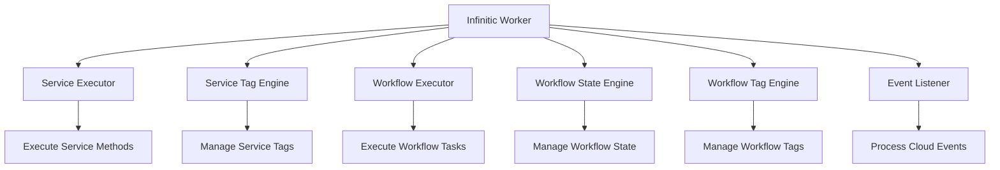

Workers are the runtime components that execute your workflows and services. They consume messages from the event streaming platform (Apache Pulsar), process them, and produce responses.

## What is a Worker?

An Infinitic Worker is a long-running process that:

- **Consumes messages** from Pulsar topics
- **Executes workflows** by running workflow tasks
- **Executes services** by calling service methods
- **Manages state** for workflow engines and tag engines
- **Handles retries** for failed tasks
- **Scales horizontally** by adding more worker instances

<CardGroup cols={2}>
  <Card title="Multiple Components" icon="cubes">
    Workers can run executors, engines, and event listeners
  </Card>
  <Card title="Horizontal Scaling" icon="up-right-and-down-left-from-center">
    Add more workers to handle increased load
  </Card>
  <Card title="Fault Tolerant" icon="shield-check">
    Workers can fail and restart without data loss
  </Card>
  <Card title="Configurable" icon="sliders">
    Fine-tune concurrency, retries, and timeouts
  </Card>
</CardGroup>

## Worker Architecture

A worker instance from `InfiniticWorker.kt` can run several components:



## Creating a Worker

### Using Builder Pattern

```kotlin
import io.infinitic.workers.InfiniticWorker
import io.infinitic.workers.config.*
import io.infinitic.transport.config.TransportConfig

fun main() {
    val worker = InfiniticWorker.builder()
        .setName("my-worker")
        .setTransport(
            TransportConfig.builder()
                .setPulsar(
                    PulsarConfig.builder()
                        .setBrokerServiceUrl("pulsar://localhost:6650")
                        .setWebServiceUrl("http://localhost:8080")
                        .setTenant("infinitic")
                        .setNamespace("dev")
                        .build()
                )
                .build()
        )
        .build()
    
    // Start the worker
    worker.start()
}
```

### Using YAML Configuration

```kotlin
import io.infinitic.workers.InfiniticWorker

fun main() {
    // Load from resources
    val worker = InfiniticWorker.fromYamlResource("/infinitic.yml")
    
    // Or from file
    // val worker = InfiniticWorker.fromYamlFile("config/infinitic.yml")
    
    // Or from string
    // val worker = InfiniticWorker.fromYamlString(yamlContent)
    
    worker.start()
}
```

<Tabs>
  <Tab title="infinitic.yml">
    ```yaml
    name: my-worker
    
    transport:
      pulsar:
        brokerServiceUrl: pulsar://localhost:6650
        webServiceUrl: http://localhost:8080
        tenant: infinitic
        namespace: dev
    
    services:
      - name: PaymentService
        class: com.example.PaymentServiceImpl
        concurrency: 10
        timeoutSeconds: 30
        retry:
          maxRetries: 5
          delaySeconds: 1.0
      
      - name: EmailService
        class: com.example.EmailServiceImpl
        concurrency: 20
    
    workflows:
      - name: OrderWorkflow
        class: com.example.OrderWorkflowImpl
        concurrency: 5
        stateEngine:
          concurrency: 3
          storage:
            redis:
              host: localhost
              port: 6379
    ```
  </Tab>
  
  <Tab title="Java Example">
    ```java
    import io.infinitic.workers.InfiniticWorker;
    
    public class WorkerApp {
        public static void main(String[] args) {
            InfiniticWorker worker = InfiniticWorker.fromYamlResource(
                "/infinitic.yml"
            );
            
            worker.start();
        }
    }
    ```
  </Tab>
</Tabs>

<Note>
The worker configuration is defined in `InfiniticWorkerConfig.kt` and supports multiple services and workflows in a single worker instance.
</Note>

## Worker Components

### Service Executor

Executes service methods when workflows call them:

```yaml
services:
  - name: PaymentService
    class: com.example.PaymentServiceImpl
    concurrency: 10          # Number of parallel executions
    timeoutSeconds: 30       # Timeout per task
    retry:
      maxRetries: 5
      delaySeconds: 1.0
    batch:
      maxMessages: 100       # Batch up to 100 messages
      maxSeconds: 1          # Or batch for 1 second
```

### Service Tag Engine

Manages tags for service tasks (routing and querying):

```yaml
services:
  - name: PaymentService
    class: com.example.PaymentServiceImpl
    tagEngine:
      concurrency: 5
      storage:
        redis:
          host: localhost
          port: 6379
```

### Workflow Executor

Executes workflow tasks (the actual workflow code):

```yaml
workflows:
  - name: OrderWorkflow
    class: com.example.OrderWorkflowImpl
    concurrency: 5
    timeoutSeconds: 60
    checkMode: strict        # Validate workflow determinism
```

### Workflow State Engine

Manages workflow state and orchestration:

```yaml
workflows:
  - name: OrderWorkflow
    class: com.example.OrderWorkflowImpl
    stateEngine:
      concurrency: 10
      storage:
        postgres:
          host: localhost
          port: 5432
          database: infinitic
          username: user
          password: pass
      cache:
        caffeine:
          maximumSize: 10000
          expireAfterWriteSeconds: 3600
```

### Workflow Tag Engine

Manages tags for workflows (finding workflows by custom identifiers):

```yaml
workflows:
  - name: OrderWorkflow
    class: com.example.OrderWorkflowImpl
    tagEngine:
      concurrency: 5
      storage:
        mysql:
          host: localhost
          port: 3306
          database: infinitic
```

## Storage Options

Workers support multiple storage backends for state persistence:

<Tabs>
  <Tab title="Redis">
    ```yaml
    storage:
      redis:
        host: localhost
        port: 6379
        username: user      # Optional
        password: pass      # Optional
        database: 0         # Optional
        ssl: false          # Optional
    ```
  </Tab>
  
  <Tab title="PostgreSQL">
    ```yaml
    storage:
      postgres:
        host: localhost
        port: 5432
        database: infinitic
        username: user
        password: pass
        # Optional: table name (default: infinitic_state)
        keyValueTable: custom_state_table
        # Optional: SSL configuration
        ssl:
          mode: require
    ```
  </Tab>
  
  <Tab title="MySQL">
    ```yaml
    storage:
      mysql:
        host: localhost
        port: 3306
        database: infinitic
        username: user
        password: pass
        # Optional: table name
        keyValueTable: custom_state_table
    ```
  </Tab>
  
  <Tab title="In-Memory">
    ```yaml
    storage:
      inMemory: {}
    # Only for testing! Data is lost on restart
    ```
  </Tab>
</Tabs>

<Info>
Storage configuration is defined in the `infinitic-storage` module and supports pluggable backends via the `KeyValueStorage` interface.
</Info>

## Scaling Workers

### Horizontal Scaling

Run multiple worker instances to distribute load:

```bash
# Start multiple worker instances
java -jar worker.jar --config infinitic-worker-1.yml &
java -jar worker.jar --config infinitic-worker-2.yml &
java -jar worker.jar --config infinitic-worker-3.yml &
```

Each worker will consume messages from the same topics, automatically distributing the load.

### Vertical Scaling

Increase concurrency within a single worker:

```yaml
services:
  - name: PaymentService
    class: com.example.PaymentServiceImpl
    concurrency: 50              # Increase parallel executions
    retryHandlerConcurrency: 25  # Separate retry handler concurrency
    eventHandlerConcurrency: 25  # Separate event handler concurrency
```

### Specialized Workers

Deploy workers with specific responsibilities:

```yaml
# worker-executors.yml - Only runs executors
services:
  - name: PaymentService
    class: com.example.PaymentServiceImpl
    concurrency: 20
    # No tagEngine configured
```

```yaml
# worker-engines.yml - Only runs engines
services:
  - name: PaymentService
    # No class - won't run executor
    tagEngine:
      concurrency: 10
      storage:
        redis:
          host: localhost
```

## Worker Lifecycle

```kotlin
fun main() {
    val worker = InfiniticWorker.fromYamlResource("/infinitic.yml")
    
    // Add shutdown hook
    Runtime.getRuntime().addShutdownHook(Thread {
        println("Shutting down worker...")
        worker.close()
    })
    
    // Start synchronously (blocks current thread)
    worker.start()
    
    // Or start asynchronously
    // val future = worker.startAsync()
    // ... do other work ...
    // future.get()
}
```

The worker gracefully shuts down:

1. Stops consuming new messages
2. Completes in-flight messages (up to `shutdownGracePeriodSeconds`)
3. Closes connections to transport and storage
4. Logs statistics about processed messages

<Note>
The default shutdown grace period is configurable via the transport configuration. If messages aren't completed within this period, they may not be processed properly.
</Note>

## Monitoring Workers

Workers provide logging and metrics:

```kotlin
// Access worker configuration
val workerName = worker.config.name
val services = worker.config.services
val workflows = worker.config.workflows

// Access embedded client
val client = worker.client

// During shutdown, workers log message statistics
// * TaskExecutor: 42 remaining (1000 received)
// * WorkflowStateEngine: 5 remaining (500 received)
```

## Event Listeners

Workers can process Cloud Events for observability:

```yaml
eventListener:
  class: com.example.MyEventListener
  concurrency: 5
  subscriptionName: my-subscription
  batch:
    maxMessages: 50
    maxSeconds: 1
```

```kotlin
import io.infinitic.events.CloudEventListener
import io.cloudevents.CloudEvent

class MyEventListener : CloudEventListener {
    override fun onEvent(event: CloudEvent) {
        println("Event: ${event.type} - ${event.id}")
        
        when (event.type) {
            "workflow.started" -> handleWorkflowStarted(event)
            "workflow.completed" -> handleWorkflowCompleted(event)
            "task.started" -> handleTaskStarted(event)
            "task.completed" -> handleTaskCompleted(event)
            "task.failed" -> handleTaskFailed(event)
        }
    }
    
    private fun handleWorkflowStarted(event: CloudEvent) {
        // Send to monitoring system
    }
    
    // ... other handlers
}
```

## Best Practices

<CardGroup cols={2}>
  <Card title="Separate Concerns" icon="layer-group">
    Run executors and engines in separate worker instances for better scaling
  </Card>
  <Card title="Monitor Resources" icon="chart-line">
    Track CPU, memory, and message lag to optimize worker configuration
  </Card>
  <Card title="Use Caching" icon="bolt">
    Enable caching for workflow state to reduce storage load
  </Card>
  <Card title="Set Appropriate Timeouts" icon="clock">
    Configure timeouts based on actual service response times
  </Card>
</CardGroup>

## Configuration Reference

Key configuration options from `InfiniticWorker.kt`:

| Option | Description | Default |
|--------|-------------|--------|
| `name` | Worker name for identification | Generated |
| `concurrency` | Parallel task execution | 1 |
| `timeoutSeconds` | Task timeout | None |
| `shutdownGracePeriodSeconds` | Shutdown wait time | 30 |
| `retryHandlerConcurrency` | Retry processing concurrency | Same as concurrency |
| `eventHandlerConcurrency` | Event processing concurrency | Same as concurrency |
| `checkMode` | Workflow determinism checking | null |

## Next Steps

<CardGroup cols={2}>
  <Card title="Workflows" href="/concepts/workflows" icon="diagram-project">
    Learn about workflow orchestration
  </Card>
  <Card title="Services" href="/concepts/services" icon="server">
    Understand service implementation
  </Card>
  <Card title="Clients" href="/concepts/clients" icon="laptop-code">
    Discover how to interact with workers
  </Card>
  <Card title="Architecture" href="/concepts/architecture" icon="sitemap">
    Explore the complete system architecture
  </Card>
</CardGroup>