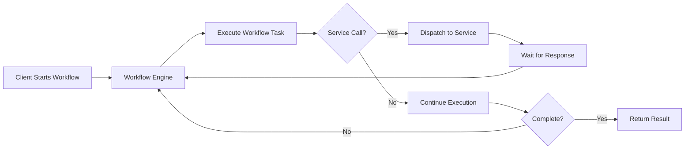

Workflows are the orchestration layer in Infinitic. They coordinate the execution of services, manage state, and define the business logic of your application using the full power of programming languages.

## What is a Workflow?

A workflow is a class that extends the `Workflow` base class and defines a sequence of operations. Workflows are:

- **Durable**: They survive failures and restarts
- **Deterministic**: They replay from their stored state
- **Stateful**: They maintain context across asynchronous operations
- **Type-safe**: They use interfaces for compile-time safety

<CardGroup cols={2}>
  <Card title="Orchestration" icon="diagram-project">
    Workflows coordinate service calls, child workflows, and timers
  </Card>
  <Card title="Durability" icon="shield-check">
    State is persisted automatically, surviving failures
  </Card>
  <Card title="Flexibility" icon="code">
    Use loops, conditions, and any programming logic
  </Card>
  <Card title="Reliability" icon="arrows-rotate">
    Automatic retries and error handling
  </Card>
</CardGroup>

## Creating a Workflow

Workflows are defined by creating an interface and an implementation that extends `Workflow`:

```kotlin
interface OrderWorkflow {
    fun processOrder(orderId: String): OrderResult
}

class OrderWorkflowImpl : Workflow(), OrderWorkflow {
    // Service stubs
    private val paymentService = newService(PaymentService::class.java)
    private val inventoryService = newService(InventoryService::class.java)
    private val shippingService = newService(ShippingService::class.java)
    
    override fun processOrder(orderId: String): OrderResult {
        // Reserve inventory
        val reservation = inventoryService.reserve(orderId)
        
        // Process payment
        val payment = paymentService.charge(orderId, reservation.amount)
        
        // Ship order
        val shipment = shippingService.ship(orderId, reservation)
        
        return OrderResult(payment.transactionId, shipment.trackingNumber)
    }
}
```

<Note>
The workflow implementation class must extend `io.infinitic.workflows.Workflow` from the source code at `/infinitic-common/src/main/kotlin/io/infinitic/workflows/Workflow.kt`
</Note>

## Workflow Features

### Dispatching Services

Workflows can dispatch service calls asynchronously using the `dispatch` method:

```kotlin
class ParallelWorkflowImpl : Workflow(), ParallelWorkflow {
    private val service = newService(DataService::class.java)
    
    override fun processData(items: List<String>): List<Result> {
        // Dispatch all calls in parallel
        val deferreds = items.map { item ->
            dispatch(service::process, item)
        }
        
        // Wait for all results
        return deferreds.map { it.await() }
    }
}
```

### Deferred Objects

The `Deferred<T>` class represents an asynchronous computation. It provides methods to:

- `await()`: Wait for completion and get the result
- `status()`: Check current status (ONGOING, COMPLETED, FAILED, CANCELED, UNKNOWN)
- `isCompleted()`, `isFailed()`, `isCanceled()`: Check specific states

```kotlin
val deferred = dispatch(service::longRunning, params)

// Check status without blocking
if (deferred.isOngoing()) {
    // Do something else
}

// Wait for result
val result = deferred.await()
```

### Combining Deferreds

You can combine multiple deferred objects using `and` and `or` operators:

```kotlin
// Wait for all to complete
val all = and(deferred1, deferred2, deferred3)
val results = all.await() // Returns List<T>

// Wait for any to complete
val any = or(deferred1, deferred2, deferred3)
val firstResult = any.await() // Returns T
```

### Timers

Workflows can create timers for delays and scheduling:

```kotlin
import java.time.Duration
import java.time.Instant

class TimerWorkflowImpl : Workflow(), TimerWorkflow {
    override fun processWithDelay() {
        // Wait for 1 hour
        timer(Duration.ofHours(1)).await()
        
        // Or schedule for specific time
        timer(Instant.parse("2026-12-31T23:59:59Z")).await()
    }
}
```

### Channels

Channels enable communication with running workflows via signals:

```kotlin
class ApprovalWorkflowImpl : Workflow(), ApprovalWorkflow {
    private val approvalChannel = channel<Boolean>()
    
    override fun requestApproval(requestId: String): String {
        // Wait for approval signal
        val approved = approvalChannel.receive()
        
        if (approved) {
            return "Approved: $requestId"
        } else {
            return "Rejected: $requestId"
        }
    }
    
    override fun sendApproval(approved: Boolean) {
        approvalChannel.send(approved)
    }
}
```

### Child Workflows

Workflows can start and manage child workflows:

```kotlin
class ParentWorkflowImpl : Workflow(), ParentWorkflow {
    override fun orchestrate() {
        // Create a new child workflow
        val childWorkflow = newWorkflow(ChildWorkflow::class.java)
        
        // Execute child workflow method
        val result = childWorkflow.process()
        
        // Or dispatch asynchronously
        val deferred = dispatch(childWorkflow::process)
        val result = deferred.await()
    }
}
```

### Inline Tasks

For simple computations, use inline tasks that execute without creating new service calls:

```kotlin
class CalculationWorkflowImpl : Workflow(), CalculationWorkflow {
    override fun calculate(values: List<Int>): Int {
        return inline {
            values.sum() * 2
        }
    }
}
```

## Workflow Context

The `Workflow` class provides static methods to access workflow context:

```kotlin
class ContextAwareWorkflowImpl : Workflow(), ContextAwareWorkflow {
    override fun logContext() {
        println("Workflow Name: ${Workflow.workflowName}")
        println("Workflow ID: ${Workflow.workflowId}")
        println("Method Name: ${Workflow.methodName}")
        println("Method ID: ${Workflow.methodId}")
        println("Tags: ${Workflow.tags}")
        println("Meta: ${Workflow.meta}")
    }
}
```

<Info>
Workflow context is available throughout the workflow execution via static properties on the `Workflow` companion object.
</Info>

## Workflow Lifecycle



## Best Practices

<CardGroup cols={2}>
  <Card title="Keep Workflows Deterministic" icon="check">
    Avoid non-deterministic operations like random numbers or current time. Use workflow context instead.
  </Card>
  <Card title="Use Interfaces" icon="layer-group">
    Define workflow contracts with interfaces for better testing and versioning.
  </Card>
  <Card title="Minimize State" icon="database">
    Keep workflow state small. Store large data in external systems and reference by ID.
  </Card>
  <Card title="Handle Errors" icon="triangle-exclamation">
    Use try-catch blocks and implement compensation logic for failed operations.
  </Card>
</CardGroup>

## Error Handling

Workflows can handle errors from service calls:

```kotlin
class ResilientWorkflowImpl : Workflow(), ResilientWorkflow {
    private val service = newService(PaymentService::class.java)
    
    override fun processPayment(orderId: String): PaymentResult {
        try {
            return service.charge(orderId)
        } catch (e: PaymentException) {
            // Compensation logic
            service.refund(orderId)
            throw e
        }
    }
}
```

## Next Steps

<CardGroup cols={2}>
  <Card title="Services" href="/concepts/services" icon="server">
    Learn about implementing services that workflows orchestrate
  </Card>
  <Card title="Workers" href="/concepts/workers" icon="gears">
    Understand how workers execute workflows and services
  </Card>
  <Card title="Clients" href="/concepts/clients" icon="laptop-code">
    Discover how to start and interact with workflows
  </Card>
  <Card title="Architecture" href="/concepts/architecture" icon="sitemap">
    Explore the complete Infinitic architecture
  </Card>
</CardGroup>