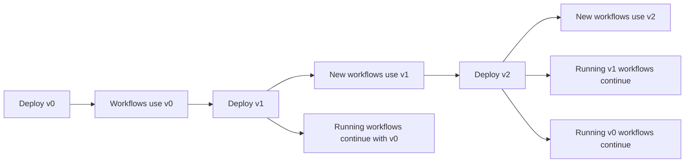

Workflow versioning allows you to update workflow logic while existing workflow instances continue running with their original code. This is essential for evolving your application without disrupting long-running workflows.

## Why Versioning?

Workflows can run for extended periods (days, weeks, or months). During this time, you may need to:

- Fix bugs in workflow logic
- Add new features
- Optimize performance
- Change business rules

Versioning ensures that:
- Existing workflow instances complete with their original logic
- New workflow instances use the latest implementation
- No breaking changes affect running workflows

## How Versioning Works

Infinitic uses a simple naming convention for workflow versions:

1. Create your workflow interface (unchanged)
2. Implement multiple versions with `_N` suffix (where N is the version number)
3. New workflows automatically use the highest version number
4. Running workflows continue with their original version

## Creating Versioned Workflows

<Steps>
  <Step title="Define the workflow interface">
    Create your workflow interface as usual:

    ```kotlin
    interface OrderWorkflow {
      fun processOrder(orderId: String): OrderResult
    }
    ```
  </Step>

  <Step title="Create the initial implementation">
    Create the first version (no suffix):

    ```kotlin
    class OrderWorkflowImpl : Workflow(), OrderWorkflow {
      private val paymentService = newService(PaymentService::class.java)
      
      override fun processOrder(orderId: String): OrderResult {
        val payment = paymentService.charge(orderId)
        return OrderResult(payment)
      }
    }
    ```
  </Step>

  <Step title="Create a new version">
    When you need to update the workflow, create a new version with `_N` suffix:

    ```kotlin
    class OrderWorkflowImpl_1 : Workflow(), OrderWorkflow {
      private val paymentService = newService(PaymentService::class.java)
      private val emailService = newService(EmailService::class.java)
      
      override fun processOrder(orderId: String): OrderResult {
        val payment = paymentService.charge(orderId)
        
        // New feature: send confirmation email
        emailService.sendConfirmation(orderId)
        
        return OrderResult(payment)
      }
    }
    ```
  </Step>
</Steps>

## Version Selection

Infinitic automatically selects the version:

- **New workflows**: Use the highest version number available
- **Running workflows**: Continue with their original version

<CodeGroup>
```kotlin Initial Version
// OrderWorkflowImpl.kt
class OrderWorkflowImpl : Workflow(), OrderWorkflow {
  override fun name(): String = this::class.java.name
}
```

```kotlin Version 1
// OrderWorkflowImpl_1.kt
class OrderWorkflowImpl_1 : Workflow(), OrderWorkflow {
  override fun name(): String = this::class.java.name
}
```

```kotlin Client Usage
val workflow = client.newWorkflow(OrderWorkflow::class.java)

// This will dispatch using OrderWorkflowImpl_1 (highest version)
val result = workflow.name()
// Returns: "com.example.OrderWorkflowImpl_1"
```
</CodeGroup>

## Naming Convention

The version suffix must follow this pattern:

<AccordionGroup>
  <Accordion title="Base implementation (no suffix)">
    ```kotlin
    class MyWorkflowImpl : Workflow(), MyWorkflow {
      // Initial version
    }
    ```
  </Accordion>
  
  <Accordion title="Version 1">
    ```kotlin
    class MyWorkflowImpl_1 : Workflow(), MyWorkflow {
      // First update
    }
    ```
  </Accordion>
  
  <Accordion title="Version 2">
    ```kotlin
    class MyWorkflowImpl_2 : Workflow(), MyWorkflow {
      // Second update
    }
    ```
  </Accordion>
  
  <Accordion title="Version N">
    ```kotlin
    class MyWorkflowImpl_N : Workflow(), MyWorkflow {
      // Nth update
    }
    ```
  </Accordion>
</AccordionGroup>

## Version Lifecycle



## Practical Example

Here's a complete example showing workflow evolution:

### Initial Implementation

```kotlin
// Version 0 (initial)
class PaymentWorkflowImpl : Workflow(), PaymentWorkflow {
  private val paymentService = newService(PaymentService::class.java)
  
  override fun processPayment(amount: Double): PaymentResult {
    val payment = paymentService.charge(amount)
    return PaymentResult(payment.id, payment.status)
  }
}
```

### Version 1: Add Notification

```kotlin
// Version 1: Add email notification
class PaymentWorkflowImpl_1 : Workflow(), PaymentWorkflow {
  private val paymentService = newService(PaymentService::class.java)
  private val emailService = newService(EmailService::class.java)
  
  override fun processPayment(amount: Double): PaymentResult {
    val payment = paymentService.charge(amount)
    
    // New: Send email notification
    emailService.sendReceipt(payment.id)
    
    return PaymentResult(payment.id, payment.status)
  }
}
```

### Version 2: Add Fraud Check

```kotlin
// Version 2: Add fraud detection
class PaymentWorkflowImpl_2 : Workflow(), PaymentWorkflow {
  private val fraudService = newService(FraudService::class.java)
  private val paymentService = newService(PaymentService::class.java)
  private val emailService = newService(EmailService::class.java)
  
  override fun processPayment(amount: Double): PaymentResult {
    // New: Check for fraud
    val fraudCheck = fraudService.analyze(amount)
    if (fraudCheck.isFraudulent) {
      return PaymentResult.rejected("Fraud detected")
    }
    
    val payment = paymentService.charge(amount)
    emailService.sendReceipt(payment.id)
    
    return PaymentResult(payment.id, payment.status)
  }
}
```

## Migration Strategies

### Strategy 1: Wait for Natural Completion

Allow old workflows to complete naturally:

```kotlin
// Keep old versions until all instances complete
// OrderWorkflowImpl.kt - keep for running workflows
// OrderWorkflowImpl_1.kt - current version
// OrderWorkflowImpl_2.kt - deploy new version
```

### Strategy 2: Graceful Deprecation

Mark old versions but keep them available:

```kotlin
@Deprecated("Use OrderWorkflowImpl_2 instead")
class OrderWorkflowImpl_1 : Workflow(), OrderWorkflow {
  // Keep for running workflows only
}

class OrderWorkflowImpl_2 : Workflow(), OrderWorkflow {
  // New implementation
}
```

### Strategy 3: Feature Flags

Use inline logic to enable features conditionally:

```kotlin
class OrderWorkflowImpl_1 : Workflow(), OrderWorkflow {
  private val featureService = newService(FeatureService::class.java)
  
  override fun processOrder(orderId: String): OrderResult {
    val payment = paymentService.charge(orderId)
    
    // Check feature flag
    val sendEmail = inline {
      featureService.isEnabled("email-confirmation")
    }
    
    if (sendEmail) {
      emailService.sendConfirmation(orderId)
    }
    
    return OrderResult(payment)
  }
}
```

## Testing Different Versions

You can test specific versions by creating instances directly:

```kotlin
import io.kotest.core.spec.style.StringSpec
import io.kotest.matchers.shouldBe

class VersioningTest : StringSpec({
  
  "Should use latest version by default" {
    val workflow = client.newWorkflow(MyWorkflow::class.java)
    val result = workflow.name()
    result shouldBe "com.example.MyWorkflowImpl_2"
  }
  
  "Old version still works" {
    // You can't directly instantiate old versions from the client,
    // but running workflows continue with their version
    val deferred = client.dispatch(workflow::process)
    // This workflow will use whatever version it was started with
  }
})
```

## Version Cleanup

Once all workflows of an old version have completed:

<Steps>
  <Step title="Verify no active instances">
    Check that no workflows are using the old version:
    
    ```bash
    # Query your workflow state storage
    # Ensure no instances reference old version
    ```
  </Step>
  
  <Step title="Remove old implementation">
    Delete or archive the old version file:
    
    ```bash
    # Remove OrderWorkflowImpl.kt
    # Keep OrderWorkflowImpl_1.kt and OrderWorkflowImpl_2.kt
    ```
  </Step>
  
  <Step title="Update documentation">
    Document the version history and changes
  </Step>
</Steps>

## Best Practices

<AccordionGroup>
  <Accordion title="Keep version history">
    Don't delete old versions while any instances are running:
    
    ```kotlin
    // ✅ Good - keep all versions
    // OrderWorkflowImpl.kt (v0 - 5 running instances)
    // OrderWorkflowImpl_1.kt (v1 - 120 running instances)
    // OrderWorkflowImpl_2.kt (v2 - current, new instances)
    
    // ❌ Bad - deleting v0 while instances still running
    // OrderWorkflowImpl_1.kt
    // OrderWorkflowImpl_2.kt
    ```
  </Accordion>
  
  <Accordion title="Document version changes">
    Add comments explaining what changed in each version:
    
    ```kotlin
    /**
     * Version 2: Added fraud detection before payment processing
     * - Calls FraudService before charging
     * - Returns rejection if fraud detected
     * - Maintains backward compatibility with v1 return type
     */
    class PaymentWorkflowImpl_2 : Workflow(), PaymentWorkflow {
      // Implementation
    }
    ```
  </Accordion>
  
  <Accordion title="Test version compatibility">
    Ensure new versions maintain interface compatibility:
    
    ```kotlin
    // Interface must remain stable across versions
    interface MyWorkflow {
      fun process(input: String): Result
    }
    
    // All versions must implement the same interface
    class MyWorkflowImpl : Workflow(), MyWorkflow
    class MyWorkflowImpl_1 : Workflow(), MyWorkflow
    class MyWorkflowImpl_2 : Workflow(), MyWorkflow
    ```
  </Accordion>
  
  <Accordion title="Use incremental version numbers">
    Always increment from the highest existing version:
    
    ```kotlin
    // ✅ Correct sequence
    MyWorkflowImpl      // v0
    MyWorkflowImpl_1    // v1
    MyWorkflowImpl_2    // v2
    MyWorkflowImpl_3    // v3
    
    // ❌ Wrong - skipping versions
    MyWorkflowImpl      // v0
    MyWorkflowImpl_5    // Don't skip to v5
    ```
  </Accordion>
</AccordionGroup>

## Monitoring Versions

Track which versions are in use:

```kotlin
class MonitoringWorkflow : Workflow(), MonitoringWorkflowInterface {
  override fun logVersion() {
    val version = this::class.java.simpleName
    inline {
      logger.info("Running workflow version: $version")
    }
  }
}
```

## Common Pitfalls

<Warning>
  **Don't change the interface**
  
  The interface must remain stable across versions:
  
  ```kotlin
  // ❌ Wrong - changing interface signature
  interface MyWorkflow {
    // v0
    fun process(input: String): Result
    
    // v1 - DON'T DO THIS
    fun process(input: String, extra: Int): Result
  }
  
  // ✅ Correct - stable interface, different implementation
  interface MyWorkflow {
    fun process(input: String): Result
  }
  
  class MyWorkflowImpl : Workflow(), MyWorkflow {
    override fun process(input: String): Result {
      // v0 implementation
    }
  }
  
  class MyWorkflowImpl_1 : Workflow(), MyWorkflow {
    override fun process(input: String): Result {
      // v1 implementation (different logic, same signature)
    }
  }
  ```
</Warning>

<Warning>
  **Don't delete running versions**
  
  Keep all versions that have running instances:
  
  ```kotlin
  // ❌ Wrong - deleting while instances are running
  // Delete OrderWorkflowImpl.kt (but 10 instances still running!)
  
  // ✅ Correct - keep until all instances complete
  // Keep OrderWorkflowImpl.kt until all v0 instances finish
  // Then safely delete the file
  ```
</Warning>

## Next Steps

<CardGroup cols={2}>
  <Card title="Workflow Overview" icon="diagram-project" href="/workflows/overview">
    Learn more about workflow fundamentals
  </Card>
  <Card title="Defining Workflows" icon="code" href="/workflows/defining-workflows">
    Create new workflows
  </Card>
  <Card title="Testing" icon="flask" href="/testing">
    Test your workflows and versions
  </Card>
  <Card title="Deployment" icon="rocket" href="/deployment">
    Deploy workflow versions
  </Card>
</CardGroup>
